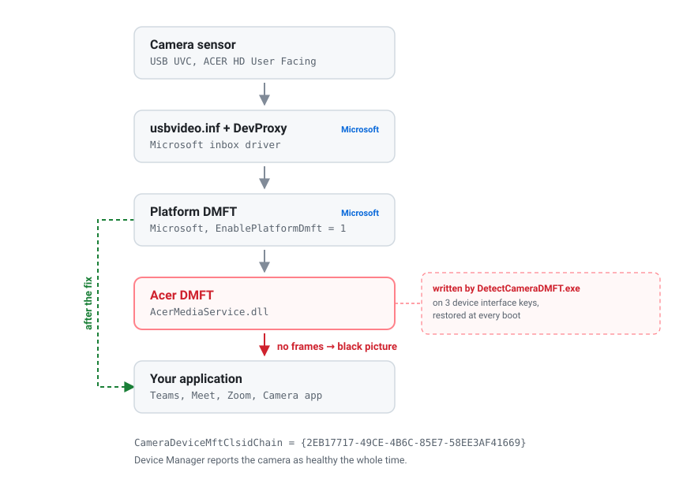
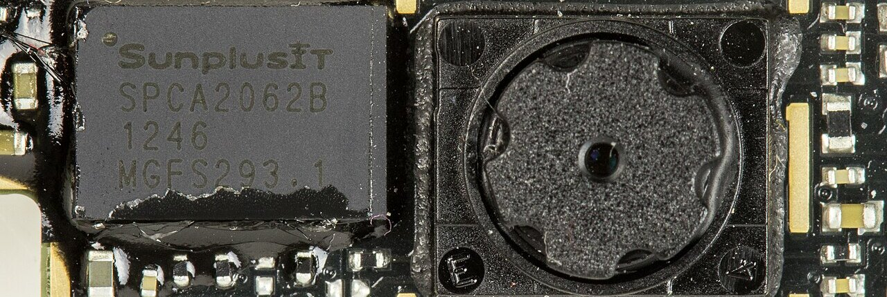

# Acer webcam black screen — root cause and fix


The webcam shows a **black picture in every application** — Camera app, Google
Meet, Teams, Zoom, the browser — while Device Manager insists it is *working
properly*. No yellow triangle, no error code. Reinstalling the driver does
nothing. Resetting the Camera app helps until the next reboot.

Acer ships a **Device MFT**: a plug-in that sits inside the Windows camera
pipeline and touches every frame before your application sees it. A background
service re-registers that plug-in at every boot. When the plug-in stops handing
frames over, everything downstream goes black while the driver and the device
stay healthy — nothing has failed, as far as Windows is concerned.

That last part is why the registry tweaks in the forum threads "work until you
reboot". `DetectCameraDMFT.exe` writes the registration back at every startup.
You have to stop the writer, not just delete what it wrote.

> [!IMPORTANT]
> Do not run the fix blind. Check first that this is actually your fault —
> see [Is this your problem?](#is-this-your-problem). The symptom is extremely
> common and most of the threads about it turn out to be something else.

## The bug in one picture

<picture>
  <source media="(prefers-color-scheme: dark)" srcset="docs/media/pipeline-dark.svg">
  
</picture>

## Is this your problem?

Run the script in its default read-only mode. It changes nothing without
`-Apply`:

```powershell
Set-ExecutionPolicy -Scope Process Bypass -Force
.\Fix-AcerCameraDMFT.ps1
```

Look for lines like these:

```
14:02:11 [WARN ] REGISTRATION  [KSCATEGORY_VIDEO_CAMERA]  CameraDeviceMftClsidChain = {2EB17717-49CE-4B6C-85E7-58EE3AF41669}
14:02:11 [WARN ] REGISTRATION  [KSCATEGORY_CAPTURE]       CameraDeviceMftClsidChain = {2EB17717-49CE-4B6C-85E7-58EE3AF41669}
14:02:11 [WARN ] REGISTRATION  [KSCATEGORY_VIDEO]         CameraDeviceMftClsidChain = {2EB17717-49CE-4B6C-85E7-58EE3AF41669}
```

**No `REGISTRATION` line, no match.** Your black screen has another cause and
this repository will not help — stop rather than start deleting things. Please
still [tell me about it](#tell-me-about-your-model): the models where this is
*not* the fault are what tells me how far the problem really reaches.

### Symptoms that match

| What you see | What is happening |
|---|---|
| Black image, no error, in every app | The DMFT is loaded and returns no frames |
| Device Manager says the camera is fine | It is fine. The break is above the driver |
| The Camera app flashes an error code, then goes black | The pipeline builds, then starves |
| Resetting the Camera app fixes it until reboot | The registration is rewritten at boot |
| Updating or rolling back the camera driver changes nothing | Wrong layer |
| The camera works in the BIOS or from a Linux live USB | Confirms the hardware is fine |

Error codes reported alongside this: `0xA00F429F`, `0xA00F4241`, `0xA00F4292`,
`0xA00F4271`, `0x80004003`, and `WindowShowFailed` / `CameraSwitchFailed` in the
Camera app diagnostics.

## Fixing it

Elevated PowerShell, on the affected machine:

```powershell
.\Fix-AcerCameraDMFT.ps1 -Apply
```

In order, it will:

1. stop and disable `AcerARTAIMMXDriverService`, the service that relaunches the
   detector;
2. export the affected registry subtrees to `%ProgramData%\CameraFix`;
3. run Acer's own `UninstallAcerCameraDMFT.exe` out of the driver store, which
   clears all three interface categories — `-Manual` deletes the values directly
   instead, for machines where the vendor binary is gone;
4. read the registry back to check;
5. restart the camera device so Media Foundation rebuilds the pipeline.

It worked immediately, with no reboot, on every machine I ran it on, and it held
across reboots afterwards. Disabling the one service was enough:
`-DisableAllServices` is there for the case where the registration comes back,
and I have never needed it.

The webcam ends up on the plain Microsoft stack, `usbvideo.inf` plus the platform
DMFT. You lose whatever Acer's effects layer was doing — background blur, auto
framing, that family of features. Given the alternative is no picture at all,
nobody here has complained.

### When the camera is busy

The one machine where the first version of this failed had a Meet call running.
`Disable-PnpDevice` will not touch a device that is in use, so the restart step
failed and someone had to walk back to that desk.

```powershell
.\Fix-AcerCameraDMFT.ps1 -Apply -Force
```

`-Force` escalates, and stops as soon as the camera comes free:

1. **Blocks camera access system wide** — the same switch as *Settings → Privacy
   & security → Camera → Camera access*, written to the machine hive and to
   every loaded user hive. Running streams get dropped and nothing new can grab
   the device while the fix is in flight.
2. **Kills the capture helper.** Chromium keeps the camera in a dedicated
   utility process, so Chrome, Edge and Electron apps lose the camera while the
   tabs stay open.
3. **Closes whatever is still streaming**, read out of the consent store rather
   than guessed from a list of app names, with a hard exclusion list so it never
   goes after `svchost`, `explorer` and friends.
4. **Stops the frame server.** `FrameServer` and `FrameServerMonitor` are
   trigger-start, so Windows brings them back on demand. If a service refuses to
   stop, its host process is killed — but only after checking that it hosts
   nothing but those two.
5. **Restarts the device**: `pnputil /restart-device`, then disable/enable, then
   as a last resort remove the device node and rescan.

Camera access is restored in a `finally` block, and the previous value of every
key is written to `%ProgramData%\CameraFix\camera-access-state.json` *before*
anything changes. If the run is interrupted anyway, the next one notices that
file and puts the setting back before doing anything else; `-Rollback` forces
the same.

> [!WARNING]
> Anyone in a call when you run `-Force` gets dropped. That is the point of the
> flag.

Two things it deliberately does not do. It will not remove and rescan a non-USB
device: an internal MIPI camera on the SoC bus may not come back without a
reboot, and a machine with no camera at all is worse than a fix that waits for
the next restart. And it only closes processes the consent store names, so an
application talking to the device by some other route may still hold it — in
which case the script says so and a reboot finishes the job.

### Rolling back

```powershell
.\Fix-AcerCameraDMFT.ps1 -Rollback -Apply
```

Services go back to Automatic and start, the detector writes the registration
back at the next boot, and you are exactly where you started. Nothing is
uninstalled and no driver package is deleted, so there is nothing to reinstall.

### Exit codes

| Code | Meaning |
|---|---|
| 0 | Clean — no third-party DMFT registration left |
| 1 | Registration still there, read the log |
| 2 | Not running elevated |
| 3 | Registration removed, device restart incomplete — reboot |

Logs, registry backups and the access state file all land in
`%ProgramData%\CameraFix`.

### More than one machine

Nothing in the script is machine specific. It finds the driver store package by
its original INF name and the device by walking the registrations it found, so
the `oemNN.inf` numbers — which differ on every machine — never come into it.

```powershell
# Intune / PDQ / any RMM, running as SYSTEM
powershell.exe -NoProfile -ExecutionPolicy Bypass -File .\Fix-AcerCameraDMFT.ps1 -Apply -Force
```

Running as SYSTEM is handled: the consent store is per user, so the script walks
`HKEY_USERS` rather than trusting `HKCU`, which under SYSTEM is empty.

## Tell me about your model

This was found on one model family, on one managed fleet. The Acer extension INF
binds to subsystem IDs across Predator, Nitro, Aspire, Swift, TravelMate and
Extensa, so the component is installed far more widely than I can test — but I
am not going to claim a reach I have not measured.

If you hit this on another machine, **[open an issue][new-issue]** with the
read-only output. I will look at every one and widen the script where the
evidence supports it. Reports where it turns out *not* to be this bug are worth
just as much.

[new-issue]: https://github.com/bineurale/acer-camera-black-screen-fix/issues/new?template=model-report.yml

`tools/Camera-Diag.ps1` is what makes those reports useful. It is read-only and
dumps the whole camera pipeline to a text file: devices and their driver
packages, frame server state, everything registered on the three KS interface
categories, Media Foundation platform keys, permissions, which application is
holding the camera right now, recent driver installs from `setupapi.dev.log`,
update history, PnP events.

```powershell
.\tools\Camera-Diag.ps1
```

Run it on a broken machine and on a working one of the same model, then diff the
two files. That comparison is what found this bug in the first place. It is not
Acer specific either — the DMFT section is worth a look on any laptop with a
vendor camera effects stack, and Dell, HP, Lenovo and Intel all ship one.

## What the fix removes

The chain is written to three device interface keys under
`HKLM\SYSTEM\CurrentControlSet\Control\DeviceClasses\`, one per KS category:

| GUID | Category |
|---|---|
| `{e5323777-f976-4f5b-9b55-b94699c46e44}` | KSCATEGORY_VIDEO_CAMERA |
| `{65E8773D-8F56-11D0-A3B9-00A0C9223196}` | KSCATEGORY_CAPTURE |
| `{6994AD05-93EF-11D0-A3CC-00A0C9223196}` | KSCATEGORY_VIDEO |

Cleaning only the first is a half fix: the other two are what DirectShow reads.
Turning off frame server mode does not help either — the registration is on the
DirectShow categories too, and the COM object has no 32-bit registration, so
there is no configuration that routes around it.

The full write-up, with the evidence behind each step and the list of things I
tried that turned out to be wrong, is in **[docs/root-cause.md](docs/root-cause.md)**.



<sup>A laptop webcam module of the kind involved — a UVC camera on a small board behind the lid bezel. Photo: Raimond Spekking, [CC BY-SA 4.0](https://creativecommons.org/licenses/by-sa/4.0/), cropped. Full credits in [docs/media/CREDITS.md](docs/media/CREDITS.md).</sup>

## Where it was found

- **Acer Aspire A315-44P**, Ryzen 7 5700U, Windows 11 build 26200, BIOS Insyde V1.13
- Camera: ACER HD User Facing (Quanta), `USB\VID_0408&PID_4033`
- Driver: `usbvideo.inf` 10.0.26100.8972 — Microsoft inbox UVC, device state OK, problem code 0
- Component: `acerartaimmxdrivercomponent.inf` 2.0.3038.0, `AcerMediaService.dll` 2.0.3038.0
- CLSID: `{2EB17717-49CE-4B6C-85E7-58EE3AF41669}`, registered as "Acer Media Service"
- Broke after `KB5121003`, `KB5123304`, `KB5120708`; a second machine broke in
  July after `KB5120102`, `KB5101650`, `KB5100998`

The script reads the CLSID off your machine instead of assuming mine, so it
should behave sensibly where the numbers differ.

**Not tested.** The sibling package family `acergaicameracomponent.inf` / "Acer
GAI Camera Service", which I found on a second machine and which looks like the
same mechanism under another name — the script detects its services and
packages, but I have never had to run the fix against it. Windows 10, where the
code paths are 5.1 compatible and `pnputil /restart-device` is skipped when
missing, but which I have not tried. And cameras that are not USB, which the
forceful remove-and-rescan step refuses to touch on purpose.

## For Acer and Microsoft engineers

The short version, with everything needed to reproduce it:

`AcerARTAIMMXDriverService` (`AAADSvc.exe`, from
`acerartaimmxdrivercomponent.inf` 2.0.3038.0) launches `DetectCameraDMFT.exe` at
every boot, which writes `CameraDeviceMftClsidChain` =
`{2EB17717-49CE-4B6C-85E7-58EE3AF41669}` onto the camera's device interface keys
in all three KS categories. Media Foundation then loads `AcerMediaService.dll`
2.0.3038.0 as a Device MFT after the platform DMFT. `CoCreateInstance` on the
CLSID succeeds, the DMFT loads, and it delivers no samples — no error, no event
log entry, no problem code.

The timing says which side changed: `AcerMediaService.dll` is dated 14 July 2026
and the cameras worked until 27 August 2026, so the August cumulative is what
made that DMFT incompatible, not the component on its own.

And the detail that tends to end the argument quickly: **Acer's own
`UninstallAcerCameraDMFT.exe`, shipped inside the same driver package, resolves
it.**

## License

MIT — see [LICENSE](LICENSE). The banner photograph is CC BY-SA 4.0, credited
above.

Provided as is. It disables a vendor service and edits device interface keys on
a machine you presumably care about. Everything it does is reversible, and the
default mode changes nothing, but read the script before you run it on someone
else's laptop.
